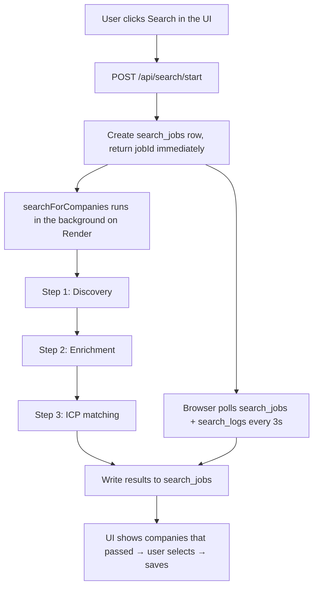

# The Three-Step Search Pipeline

A detailed walkthrough of how a search actually works, end to end. This is the core of the app.
All of it lives in [`lib/search.ts`](lib/search.ts), orchestrated by `searchForCompanies()`.
For the higher-level system overview see [HANDOVER.md](HANDOVER.md).

## Overview

The search is **long-running (~15 min)**, so it does NOT run inside the HTTP request. Instead:

1. `POST {NEXT_PUBLIC_WORKER_URL}/api/search/start` creates a `search_jobs` row and fires
   `searchForCompanies(jobId, step3Mode, searchConcepts)` **fire-and-forget**, then returns the
   `jobId` immediately.
2. The work continues on the server after the response is sent — this only works on an **always-on
   server** (Render, or `next dev` locally), never on serverless (Vercel), which kills the function
   once it responds.
3. The browser **polls** `search_jobs` (status/message) and `search_logs` (live log lines) every
   3 seconds, showing "Step X of 3", an elapsed timer, and an expandable log panel.

Two logging channels run throughout:
- `emit()` — writes a line to the terminal **and** to the `search_logs` table (→ the live log panel).
- `reportProgress()` — updates `search_jobs.message` (→ the "Step X of 3" status text).

## Safety: overall timeout

A shared `AbortController` aborts all in-flight Anthropic calls after **30 minutes**, covering
steps 1+2+3. This guarantees a stalled `web_search` can never hang the job forever. Companies saved
incrementally along the way are kept even if the run is aborted.

## Before Step 1: queue housekeeping

- Rows in `discovery_queue` stuck in `status = "processing"` for **> 10 min** are reset to
  `pending` (using `processing_started_at`), so a previous crashed run doesn't block the queue.
- The number of `pending` rows is counted — this decides whether Step 1 runs (see below).

---

## Step 1 — Discovery (`discoverCompanies`)

**Goal:** find NEW company names from trade-media sources.

- **Runs only if the queue has < 5 pending companies.** If there's already plenty to enrich, Step 1
  is skipped to save cost and avoid over-filling the queue.
- **Model:** `claude-sonnet-5`, `web_search` tool with **max 12 uses**, `max_tokens` **32000**.
- **Queries** = **selected search terms × each source's `search_prefix`**. With the default 3 terms
  and 4 sources that's 3 × 4 = **12 queries = the search budget**. The terms come from the UI
  (`searchConcepts`), falling back to `config/sources.json` → `search_concepts` when none are
  selected. Sources come from `config/sources.json` → `sources`.
- **Avoids duplicates two ways:**
  1. Known company names (from `companies` + `discovery_queue`) are passed into the prompt so the
     model only returns companies we don't already have.
  2. In code, results are filtered against a normalized set of existing/rejected/queued names
     (`normalizeName` strips legal suffixes and parentheticals, so "Doppelherz GmbH" == "Doppelherz").
- **Output:** up to ~10 new `{ name, source_name }` objects, upserted into `discovery_queue` with
  `status = "pending"`.

> **Why the tuned `max_tokens`:** server-tool `web_search` sums output across rounds. Too low a
> `max_tokens` truncates the final JSON and parsing fails silently (returns 0 companies). Don't
> lower 32000 casually.

---

## Step 2 — Enrichment (`enrichAll` / `enrichCompany`)

**Goal:** research each queued company and gather structured fields.

- Picks the **next up to 5 pending** companies from `discovery_queue` (oldest first), marks them
  `processing` with a `processing_started_at` timestamp.
- **Cache check first:** any company that already has `enriched_data` in `companies` is reused for
  free — no API call.
- **Cache misses** are enriched in parallel (concurrency 5). Each call: `claude-sonnet-5`,
  `web_search` **max 3 uses**, `max_tokens` **8000**.
- **Fields gathered per company** (`EnrichedCompany`): `website_url`, `product_focus`,
  `omega3_or_krill`, `self_presentation`, `price_tier`, `price_found`, `price_currency`,
  `european_markets`, `distribution_channels`.
- **Incremental save:** each company is written to `companies` (`added = false`,
  `rejected = false`, `enriched_data`, `enriched_at`) **the moment its enrichment completes**. So a
  company that hangs can never take down the others' work, and on a later search it becomes a cache
  hit.
- **Failures** (parse failure, abort, timeout) reset that company back to `pending` so it's retried
  on the next search; the rest proceed.

---

## Step 3 — ICP matching (`evaluateCompanies`)

**Goal:** score the enriched companies against the Lysoveta ICP and keep only the good matches.

- **Model:** `claude-sonnet-5`, **no `web_search`** (pure reasoning over already-gathered data →
  cheap and fast), `max_tokens` **16000**.
- **Prompt** (`buildStep3Prompt`) embeds `config/icp.md` + the enriched JSON, and asks the model to
  apply hard exclusions, compute an ICP fit score, assign a priority tier, and write a short
  justification.
- **Output per company** (`EvaluatedCompany`): `name`, `website_url`, `description`,
  `priority_tier`, `icp_score`, `geography`, `product_category`, `max_price_eur`, `price_currency`.
- **Only companies that pass are returned** (stored in `search_jobs.results`). Enriched companies
  that do NOT come back are marked `rejected = true` in `companies` (preserving `enriched_data`).
- **Runs before `clearTimeout`**, so it's covered by the 30-min budget.

### Automatic vs. manual, and the fallback

- `step3Mode = "auto"` (the default, and currently the only option — the UI switch is locked) runs
  the evaluation via the API as above.
- `step3Mode = "manual"` skips the API call and just builds the prompt; the UI then shows a box for
  the user to paste the prompt into Claude Chat and paste the JSON back. (Disabled in the UI now,
  but the code path still exists.)
- **Fallback:** if automatic evaluation fails (API error, aborted, or unparseable JSON),
  `evaluateCompanies` returns `null`; the job stores the manual prompt instead and the UI falls back
  to the paste box. A finished (expensive) job is therefore never lost.

---

## After the pipeline: review & save (in the UI)

1. On job `done` with `results`, the UI jumps straight to a selectable list of passing companies.
2. The user ticks the ones to keep, can adjust fields, and saves.
3. **Save** (`handleSave`): upserts the chosen companies to `companies` with `added = true`,
   removes them from `discovery_queue`, and marks any shown-but-not-selected companies as
   `rejected`.
4. The Company Database view then shows companies where `added = true` and `rejected = false`.

## Data handoff between steps

| Step | Input | Output type | Persisted to |
|---|---|---|---|
| 1 Discovery | selected terms + sources + known names | `DiscoveredCompany { name, source_name }` | `discovery_queue` (pending) |
| 2 Enrichment | up to 5 pending companies | `EnrichedCompany` (9 research fields) | `companies` (added=false) |
| 3 ICP matching | enriched companies + `icp.md` | `EvaluatedCompany` (score, tier, geo, price…) | `search_jobs.results` |
| Save (UI) | user-selected results | — | `companies` (added=true) |

## Config knobs (`config/sources.json`)

- `search_concepts` — the default search terms (used when the user selects none).
- `keyword_bank` — the wider pool of terms the UI lets the user choose from.
- `sources` — each with `name`, `url`, `search_prefix`, optional `note`.
- `enrichment_model` — the model used for Step 2 (defaults to `claude-sonnet-5`).

## Volume ceiling

4 sources × 3 terms saturates the 12-search budget. To keep discovering NEW companies over time:
add sources, rotate/expand terms, or (bigger effort) read source hub pages directly. See the
roadmap in [HANDOVER.md](HANDOVER.md).
