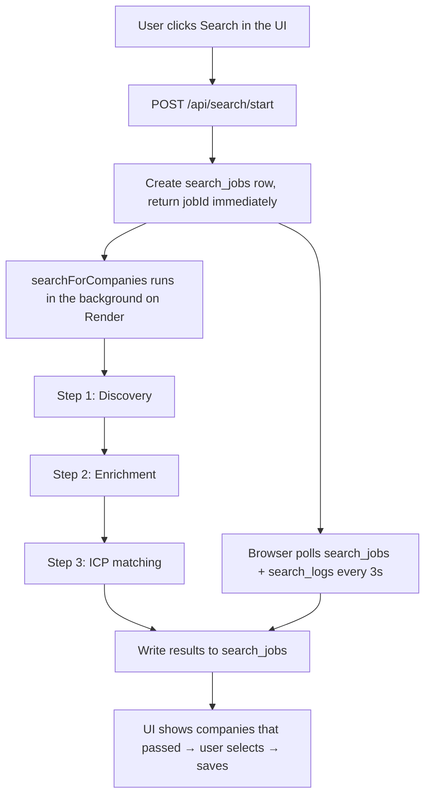

# The Three-Step Search Pipeline

A detailed walkthrough of how a search actually works, end to end. This is the core of the app.
All of it lives in [`lib/search.ts`](lib/search.ts), orchestrated by `searchForCompanies()`.
For the higher-level system overview see [HANDOVER.md](HANDOVER.md).

## Overview

The search is **long-running (~15 min)**, so it does NOT run inside the HTTP request. Instead:

1. `POST {NEXT_PUBLIC_WORKER_URL}/api/search/start` creates a `search_jobs` row and fires
   `searchForCompanies(jobId, step3Mode, searchConcepts, sourceNames)` **fire-and-forget**, then
   returns the `jobId` immediately. `searchConcepts` and `sourceNames` are the terms and sources the
   user ticked in the UI (empty → the worker uses the defaults / all active sources).
2. The work continues on the server after the response is sent — this only works on an **always-on
   server** (Render, or `next dev` locally), never on serverless (Vercel), which kills the function
   once it responds.
3. The browser **polls** `search_jobs` (status/message) and `search_logs` (live log lines) every
   3 seconds, showing "Step X of 3", an elapsed timer, and an expandable log panel.

Two logging channels run throughout:
- `emit()` — writes a line to the terminal **and** to the `search_logs` table (→ the live log panel).
- `reportProgress()` — updates `search_jobs.message` (→ the "Step X of 3" status text).

## Safety: overall timeout

A shared `AbortController` aborts all in-flight Anthropic calls after **30 minutes**, covering
steps 1+2+3. This guarantees a stalled `web_search` can never hang the job forever. Companies saved
incrementally along the way are kept even if the run is aborted.

## Why there's a queue (and why only 5 at a time)

Discovery and enrichment have very different costs, so they're **decoupled** through the
`discovery_queue` table:

- **Discovery (Step 1)** is cheap — one batch of web searches returns many company *names*.
- **Enrichment (Step 2)** is expensive — it's a separate `web_search` API call **per company**, and
  it takes time.

So Step 1 drops names into the queue, and Step 2 works the queue down **5 at a time**. Why 5:

- Bounds **cost and time per run** (each enrichment is a paid call), keeping the whole job inside the
  30-minute budget.
- Stays within safe **concurrency** (5 in parallel) to avoid rate limits.

And Step 1 **only runs when the queue has fewer than 5 pending** companies. Why the gate: if there's
already a healthy backlog to enrich, discovering *more* would just pile up names we've paid to find
but haven't processed — the queue would grow unbounded. So discovery pauses until the backlog is
worked down.

> **Consequence to be aware of:** if you select new sources or search terms but the queue is **≥ 5**,
> that run will **only enrich the backlog** — your new sources/terms are **not searched yet**. They
> take effect on the first run where the queue is below 5. Clicking Search while the queue is ≥ 5
> pops up a dialog that explains this and offers to **clear the waiting list** (so the run uses your
> selections) or proceed with the backlog. The search log also prints `Step 1: skipped — queue has X pending`.

## Before Step 1: queue housekeeping

- Rows in `discovery_queue` stuck in `status = "processing"` for **> 10 min** are reset to
  `pending` (using `processing_started_at`), so a previous crashed run doesn't block the queue.
- The number of `pending` rows is counted — this decides whether Step 1 runs (see below).

---

## Step 1 — Discovery (`discoverCompanies`)

**Goal:** find NEW company names from trade-media sources.

- **Runs only if the queue has < 5 pending companies.** If there's already plenty to enrich, Step 1
  is skipped to save cost and avoid over-filling the queue.
- **Model:** `claude-sonnet-5`, `web_search` tool with **max 12 uses**, `max_tokens` **32000**.
- **Queries** = **selected search terms × each selected _website_ source's `search_prefix`**. With
  the default 3 terms and 4 sources that's 3 × 4 = **12 queries = the search budget** (see
  [Why the caps](#why-the-caps-up-to-3-terms--4-sources) below). Terms and sources are both read
  from the database (`search_terms` / `sources` tables) and are chosen in the UI; if the user ticks
  none, the worker uses the default terms / all active sources. `config/sources.json` is the
  fallback if the DB read fails.
- **Per-source language:** each source has a `language` (default `en`). Before building queries the
  worker translates the terms into every non-English source language via one Claude call
  (`translateConcepts`) and queries each source in **its own language** (e.g. a `fr` source is
  searched with French terms). On any translation failure it falls back to English — no regression.
  YouTube sources use their language for `regionCode` / `relevanceLanguage` too; `web_fetch` sources
  read the page directly, so language doesn't apply to them.
- Only **"web site"** sources produce queries here. **"web page"** sources are read once via
  `web_fetch` (`discoverViaFetch`), and **"youtube"** sources go through the YouTube Data API
  (`discoverViaYouTube`) — neither consumes the 12-search web budget.

### The page-fetch path (`discoverViaFetch`)

For **"web page"** sources, `discoverCompanies` calls `discoverViaFetch` instead of building
queries. It lists each page's URL in the prompt (required — `web_fetch` only retrieves URLs already
in the conversation) and asks the model to fetch each one and extract company/brand names, returning
the same `{ name, source_name }` shape as the search path. The two result sets are concatenated, so
the dedup + `discovery_queue` upsert downstream treats them identically.

- **Model:** `claude-sonnet-5`, `web_fetch` tool with `max_uses = pages + 2`, `max_tokens` **8000**.
- **Robots/paywalls:** `web_fetch` respects `robots.txt`; a blocked page (e.g. Amazon) just returns
  an error block and is skipped — the run continues with the other pages.
- **Exhaustion:** a fixed page yields the same names every run, so after the first harvest the dedup
  step drops them all as already-known. Deactivate or delete a page source once it's been mined.
- If the run has **no website sources** selected (only page and/or YouTube), the `web_search` path
  is skipped entirely.

### The YouTube path (`discoverViaYouTube`)

For **"youtube"** sources, `discoverCompanies` calls `discoverViaYouTube`. For each selected search
term it runs a YouTube **`search.list`** (biased toward European/English content via `regionCode=GB`
/ `relevanceLanguage=en`, optionally prefixed by the source's `search_prefix`), collects the top
videos, then one **`videos.list`** call pulls their full titles + descriptions. That text goes to
`claude-sonnet-5`, which extracts finished-brand company names in the same `{ name, source_name }`
shape — merged in with the other paths.

- **Key:** server-only `YOUTUBE_API_KEY` (Render). If unset, YouTube sources are skipped with a log line.
- **Quota:** `search.list` costs 100 units, `videos.list` 1 — the free 10,000/day budget is ample.
- **Character:** experimental and noisier than trade media, US/English-leaning — treat as a
  complementary source; the ICP step filters downstream.
- **Avoids duplicates two ways:**
  1. Known company names (from `companies` + `discovery_queue`) are passed into the prompt so the
     model only returns companies we don't already have.
  2. In code, results are filtered against a normalized set of existing/rejected/queued names
     (`normalizeName` strips legal suffixes and parentheticals, so "Doppelherz GmbH" == "Doppelherz").
- **Output:** up to ~10 new `{ name, source_name }` objects, upserted into `discovery_queue` with
  `status = "pending"`.

> **Why the tuned `max_tokens`:** server-tool `web_search` sums output across rounds. Too low a
> `max_tokens` truncates the final JSON and parsing fails silently (returns 0 companies). Don't
> lower 32000 casually.

---

## Step 2 — Enrichment (`enrichAll` / `enrichCompany`)

**Goal:** research each queued company and gather structured fields.

- Picks the **next up to 5 pending** companies from `discovery_queue` (oldest first), marks them
  `processing` with a `processing_started_at` timestamp.
- **Cache check first:** any company that already has `enriched_data` in `companies` is reused for
  free — no API call.
- **Cache misses** are enriched in parallel (concurrency 5). Each call: `claude-sonnet-5`,
  `web_search` **max 3 uses**, `max_tokens` **8000**.
- **Fields gathered per company** (`EnrichedCompany`): `website_url`, `product_focus`,
  `omega3_or_krill`, `self_presentation`, `price_tier`, `price_found`, `price_currency`,
  `european_markets`, `distribution_channels`.
- **Incremental save:** each company is written to `companies` (`added = false`,
  `rejected = false`, `enriched_data`, `enriched_at`) **the moment its enrichment completes**. So a
  company that hangs can never take down the others' work, and on a later search it becomes a cache
  hit.
- **Failures** (parse failure, abort, timeout) reset that company back to `pending` so it's retried
  on the next search; the rest proceed.

---

## Step 3 — ICP matching (`evaluateCompanies`)

**Goal:** score the enriched companies against the Lysoveta ICP and keep only the good matches.

- **Model:** `claude-sonnet-5`, **no `web_search`** (pure reasoning over already-gathered data →
  cheap and fast), `max_tokens` **16000**.
- **Prompt** (`buildStep3Prompt`) embeds the ICP document(s) + the enriched JSON, and asks the model to
  apply hard exclusions, compute an ICP fit score, assign a priority tier, and write a short
  justification.
- **Per-geography ICP:** `config/icp.md` is the **European** ICP; `config/icp_us.md` is the **US**
  ICP. When `icp_us.md` holds real criteria (not the `US_ICP_PLACEHOLDER`), the prompt includes both
  and instructs the model to score each company against the ICP matching its primary market (US → US
  ICP, otherwise European). While the placeholder is in place, everything uses the European ICP —
  so US companies are never scored against a placeholder, and routing turns on automatically once
  the real US ICP is pasted in.
- **Output per company** (`EvaluatedCompany`): `name`, `website_url`, `description`,
  `priority_tier`, `icp_score`, `geography`, `product_category`, `max_price_eur`, `price_currency`.
- **Only companies that pass are returned** (stored in `search_jobs.results`). Enriched companies
  that do NOT come back are marked `rejected = true` in `companies` (preserving `enriched_data`).
- **Runs before `clearTimeout`**, so it's covered by the 30-min budget.

### Automatic vs. manual, and the fallback

- `step3Mode = "auto"` (the default, and currently the only option — the UI switch is locked) runs
  the evaluation via the API as above.
- `step3Mode = "manual"` skips the API call and just builds the prompt; the UI then shows a box for
  the user to paste the prompt into Claude Chat and paste the JSON back. (Disabled in the UI now,
  but the code path still exists.)
- **Fallback:** if automatic evaluation fails (API error, aborted, or unparseable JSON),
  `evaluateCompanies` returns `null`; the job stores the manual prompt instead and the UI falls back
  to the paste box. A finished (expensive) job is therefore never lost.

---

## After the pipeline: review & save (in the UI)

1. On job `done` with `results`, the UI jumps straight to a selectable list of passing companies.
2. The user ticks the ones to keep, can adjust fields, and saves.
3. **Save** (`handleSave`): upserts the chosen companies to `companies` with `added = true`,
   removes them from `discovery_queue`, and marks any shown-but-not-selected companies as
   `rejected`.
4. The Company Database view then shows companies where `added = true` and `rejected = false`.

## Data handoff between steps

| Step | Input | Output type | Persisted to |
|---|---|---|---|
| 1 Discovery | selected terms + sources + known names | `DiscoveredCompany { name, source_name }` | `discovery_queue` (pending) |
| 2 Enrichment | up to 5 pending companies | `EnrichedCompany` (9 research fields) | `companies` (added=false) |
| 3 ICP matching | enriched companies + `icp.md` | `EvaluatedCompany` (score, tier, geo, price…) | `search_jobs.results` |
| Save (UI) | user-selected results | — | `companies` (added=true) |

## Where the configuration lives (database, not the file anymore)

The search terms and sources are stored in the **database** and edited from the app (no redeploy):

- **`search_terms`** table — `term`, `is_default` (used when the user selects none), `active`.
- **`sources`** table — `type` (`web site` | `web page`), `name`, `url`, `search_prefix`
  (required for `web site`), `note` (free-text instruction handed to the model for that source),
  `active`.
- **`enrichment_model`** for Step 2 still comes from `config/sources.json` (defaults to
  `claude-sonnet-5`).

`config/sources.json` is kept **only as a fallback** — if the DB read fails, the worker
(`getSearchConfig`) and the UI both fall back to the values in that file. The DB was seeded from it
(see [`db/migrations/001_sources_search_terms.sql`](db/migrations/001_sources_search_terms.sql)).

How each source field is used in the search:

| Field | Used for |
|---|---|
| `search_prefix` (website) | Builds the actual query, literally `"<prefix> <term>"` (e.g. `nutraingredients.com Europe longevity`). |
| `url` | Shown to the model as context (website), or the exact page to read (single page). |
| `note` | Injected into the Step 1 prompt as a per-source instruction (paywall tips, region focus, etc.). |

> **How to change it:** end users add, **edit (all fields)**, and remove terms and sources from the
> **Search Configuration** panel on the *Find New Companies* tab. Edit mode is a local **draft** —
> changes are batched and written to the DB only on **Save changes** (which diffs the draft against
> the DB and applies inserts/updates/deletes together). See
> [USER_GUIDE.md](USER_GUIDE.md#managing-search-terms--sources). No code change or redeploy involved.

## Why the caps (up to 3 terms / 4 sources)

The UI lets a user pick **up to 3 terms and up to 4 sources for a single search**. That is a
deliberate ceiling, not an arbitrary one — it comes straight from how Step 1 works:

1. **The search budget is exactly 12.** `web_search` is declared with `max_uses: 12`, and the
   number of queries is `terms × website-sources`. **3 × 4 = 12** fills the budget precisely.
2. **Going higher doesn't buy coverage — it wastes it.** If the matrix exceeds 12 (say 4 terms × 4
   sources = 16), the tool still stops at 12, so 4 of the combinations simply never run. You've
   widened the grid without searching it evenly — some sources/terms get skipped unpredictably.
3. **The target is only ~10 new companies.** Step 1 is told to stop once it has 10 new names, so
   extra breadth usually finds nothing new — it just spends time and tokens.
4. **Everything found in Step 1 costs money downstream.** Each discovered company is enriched in
   Step 2 (a `web_search` call per company) and scored in Step 3. A broader Step 1 inflates Step 2/3
   cost and run-time even for candidates that later get filtered out.
5. **There's a 30-minute wall.** The whole job (steps 1+2+3) shares one 30-min abort budget. A
   bloated Step 1 risks eating the budget before Step 2/3 finish.

### Trade-offs we accepted

- **3 × 4 = 12 is the sweet spot** between coverage and a bounded, affordable run (~$3–5, well under
  the timeout). We chose to pin the caps here rather than let searches grow open-ended.
- **The caps are a UI convention, not a hard DB/pipeline limit.** The pipeline would technically
  accept more, but then the guarantees above (full, even coverage within budget) break — so the cap
  lives in the UI to protect run-time and cost.
- **Leaving a list unchecked = the tuned default** (all active sources / the `is_default` terms),
  which also lands at ~12. This is the recommended baseline; explicit selection is for narrowing a
  run, not widening it.
- **Single-page sources are "free" against the budget** (fetched, not searched), so they don't
  count toward the 4 in spirit — though the UI still counts them for simplicity.

## Volume ceiling

Because 4 sources × 3 terms saturates the 12-search budget, the way to keep discovering NEW
companies over time is **not** to search wider in one run, but to **change what's in the pool**:
rotate/expand the terms, add new sources, or retire exhausted ones — all from the UI now. Adding
**"web page"** sources (read directly via `web_fetch`) is another lever for one-off brand lists. See
the roadmap in [HANDOVER.md](HANDOVER.md).
